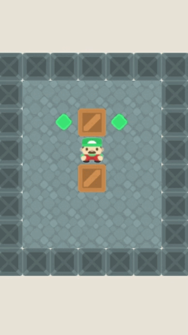
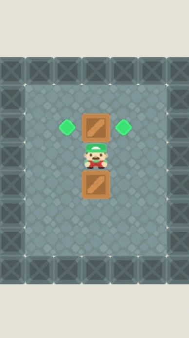

# 🎮 Sokoban AI Solver

Dự án này mô phỏng trò chơi **Sokoban** với giao diện đồ họa sử dụng **Pygame**, cho phép người dùng lựa chọn và so sánh hiệu quả giữa nhiều thuật toán trí tuệ nhân tạo trong việc giải quyết bài toán đẩy hộp.

---

## 🧩 Giới thiệu

**Sokoban** là một trò chơi logic cổ điển, trong đó người chơi điều khiển một nhân vật để đẩy các thùng vào đúng vị trí đích. Trò chơi này là một ví dụ điển hình cho các bài toán thuộc nhóm tìm kiếm trạng thái (state-space search) và bài toán ràng buộc (CSPs).

Trong dự án này, bạn có thể:
- Tự mình điều khiển nhân vật.
- Cho phép AI tự động giải bài toán với các thuật toán khác nhau.
- So sánh hiệu suất của từng thuật toán qua biểu đồ thống kê.

---

## 🧠 Các thuật toán được hỗ trợ

Dự án tích hợp **6 nhóm thuật toán AI** được hiện thực trong file `move_by_AI.py` và `q_learning.py`:

| Thuật toán                     | Nhóm               | Mô tả ngắn                                                                 |
|-------------------------------|--------------------|----------------------------------------------------------------------------|
| **BFS**                       | Search             | Tìm kiếm theo chiều rộng toàn bộ không gian trạng thái.                   |
| **A\***                      | Heuristic Search   | Tối ưu hoá đường đi với hàm đánh giá chi phí.                             |
| **Simulated Annealing**       | Local Search       | Tối ưu hóa giải pháp bằng kỹ thuật làm nguội mô phỏng.                   |
| **Partial Observation + A\***| Complex Env        | Môi trường không quan sát đầy đủ + A* để dẫn đường.                       |
| **Backtracking**              | CSPs               | Quay lui để thử tất cả các khả năng có thể.                               |
| **Q-Learning**                | Reinforcement      | Học tăng cường với bảng Q-Table để huấn luyện agent.                      |

---

## 📊 So sánh các thuật toán AI

| Thuật toán                   | Loại thuật toán         | Chiến lược tìm kiếm       | Ưu điểm chính                                      | Nhược điểm chính                                         |
|-----------------------------|--------------------------|---------------------------|---------------------------------------------------|----------------------------------------------------------|
| **BFS**                     | Tìm kiếm không heuristic | Rộng trước (Breadth-First)| Đảm bảo tìm đường đi ngắn nhất (nếu có)          | Rất tốn bộ nhớ, không hiệu quả cho không gian lớn        |
| **A\***                    | Tìm kiếm có heuristic    | f(n) = g(n) + h(n)        | Nhanh hơn BFS, có thể tối ưu hóa                 | Phụ thuộc vào chất lượng hàm heuristic                  |
| **Simulated Annealing**     | Tìm kiếm cục bộ          | Ngẫu nhiên, làm nguội     | Có thể thoát khỏi cực trị cục bộ                 | Không đảm bảo tìm được lời giải                         |
| **Partial Obs. + A\***     | Tìm kiếm tầm nhìn giới hạn | A* trong môi trường hạn chế | Thực tế hơn với môi trường quan sát một phần     | Kết quả không ổn định do giới hạn tầm nhìn              |
| **Backtracking**            | CSP (ràng buộc)           | Quay lui toàn không gian  | Đơn giản, dễ hiện thực                           | Rất chậm và dễ bị lặp trạng thái                        |
| **Q-Learning**              | Học tăng cường (RL)       | Học từ tương tác môi trường | Có khả năng học và cải thiện theo thời gian      | Cần huấn luyện nhiều, kết quả không ổn định ban đầu     |

## 🎥 Demo hoạt động của thuật toán

### ✅ Giải bằng BFS:


### 🔁 Giải bằng Backtracking:


---

## 🖥️ Giao diện và chức năng

- **Menu chính**: chọn cấp độ bản đồ từ 1–12.
- **Chọn thuật toán AI**: giao diện trực quan với các nút bấm.
- **Thống kê và biểu đồ**: ghi lại dữ liệu và hiển thị biểu đồ `Time`, `Steps`, `Path Length`.
- **Giao diện chơi thủ công hoặc tự động**.

---

## 📂 Cấu trúc dự án

```
├── main.py                  # Giao diện chính và xử lý trò chơi
├── move_by_AI.py            # Cài đặt các thuật toán AI
├── SokobanEnv.py            # Môi trường cho Q-Learning
├── q_learning.py            # Cài đặt thuật toán Q-Learning
├── assets/                  # Hình ảnh, âm thanh, đồ họa
├── data/                    # Kết quả CSV được lưu tại đây
├── map.py                   # Dữ liệu bản đồ
├── 1.gif                    # GIF minh họa BFS
├── 2.gif                    # GIF minh họa Backtracking
└── README.md                # File mô tả dự án (bạn đang đọc đây)
```

---

## ▶️ Hướng dẫn chạy chương trình

### ✅ Yêu cầu

- Python 3.x
- Cài đặt thư viện cần thiết:

```bash
pip install pygame numpy pandas matplotlib
```

### 🚀 Chạy game

```bash
python main.py
```

Sau đó:
1. Chọn level.
2. Chọn thuật toán AI để xem cách AI giải bài toán.
3. Xem trực quan quá trình giải và thống kê kết quả.

---

## 📊 Phân tích dữ liệu

- Kết quả từ mỗi lần giải được ghi vào các file CSV trong thư mục `data/`.
- Chức năng vẽ biểu đồ (dùng `matplotlib`) giúp bạn so sánh hiệu suất giữa các thuật toán theo thời gian, số bước và độ dài đường đi.

---

## 👤 Tác giả

- **Tên**: Lê Thanh Tân, Nguyễn Đình Quang Minh, Đoàn Vĩnh Phát
- **Sinh viên trường**:Đại Học sư phạm kĩ thuật

---

## 📌 Ghi chú

- Dự án này là một phần thực hành AI/Thuật toán tại trường học.
- Hỗ trợ thêm các thuật toán khác dễ dàng nhờ thiết kế module rõ ràng.
- Nhóm có mượn phần đồ họa từ dự án khác, mọi hình ảnh hiện thị không phải của chúng tôi
